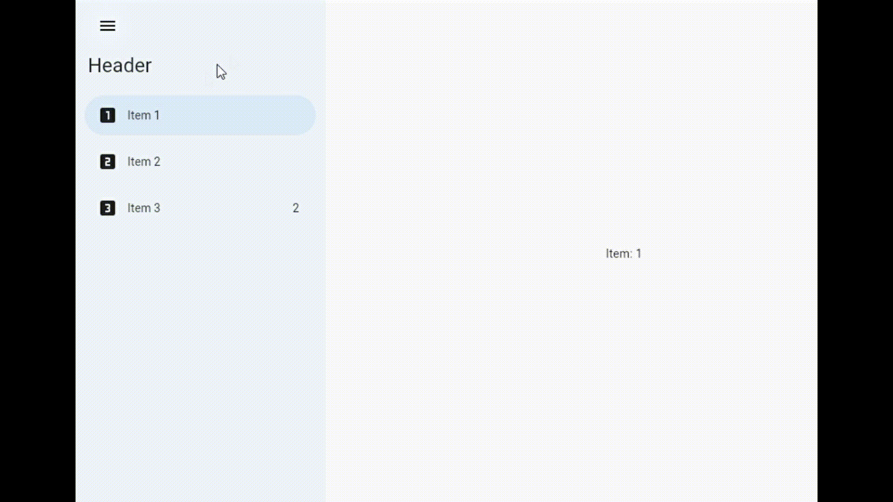

## Material 3 Navigation Drawer

Material 3 Navigation Drawer component which can animate between expanded 
([Navigation Drawer](https://m3.material.io/components/navigation-drawer/overview)) 
and collapsed state 
([Navigation Rail](https://m3.material.io/components/navigation-rail/overview)).



## Usage

```dart
Row(
    children: [
      NavigationDrawer(
        collapsible: true,
        headerBuilder: (context, animation) {
          return FadeTransition(
            opacity: animation,
            child: Padding(
              padding: const EdgeInsets.fromLTRB(16, 64, 16, 16),
              child: Text(
                'Header',
                style: Theme.of(context).textTheme.headlineSmall,
                maxLines: 1,
              ),
            ),
          );
        },
        selectedIndex: _index,
        items: [
          NavigationDrawerItem(
            icon: const Icon(Icons.looks_one),
            label: 'Item 1',
          ),
          NavigationDrawerItem(
            icon: const Icon(Icons.looks_two),
            label: 'Item 2',
          ),
          NavigationDrawerItem(
            icon: const Icon(Icons.looks_3),
            label: 'Item 3',
            indicator: '2',
          ),
        ],
        onItemTap: (index) {
          setState(() {
            _index = index;
          });
        },
      ),
      Expanded(
        // Currently selected page
        child: Center(
          child: Text('Item: ${_index + 1}'),
        ),
      ),
    ],
  )
```
